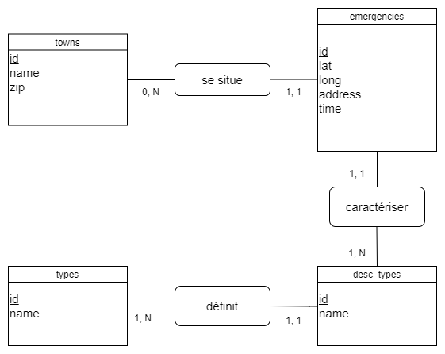
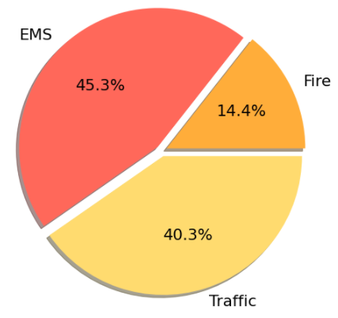
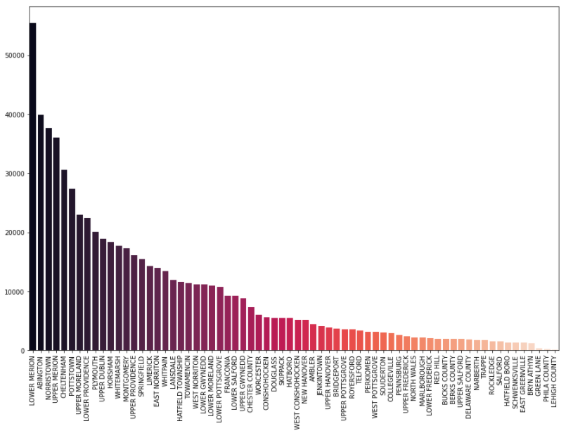
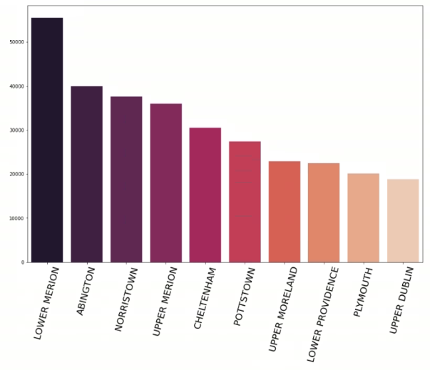

# ANALYSE DE DONNEES

---

Brief simplon sur l'analyse de données et l'utilisation de MySQL comme base de données.  

Equipe constituée de Pereg Hergoualc'h & Thomas Chaigneau.

---

## Jeu de données

Nous avons utilisé un jeu de données qui répertorie des données sur les appels d'urgences au numéro d'urgence 911 en Pennsylvanie.   

Voici les données de notre jeu de données :  
- Longitude
- Latitude
- Ville
- Code postal
- Adresse
- Description
- Date & Heure
- Colonne remplie de 1 (dummies)

Mais pour notre analyse nous avons décidé de ne garder que quelques colonnes dans notre jeu de données. Nous avons donc retiré les colonnes `Description` et la colone remplie de 1.  

## Présentation du MCD

Nous avons fait le choix de diviser notre jeu de données en trois tables.



Une fois la bdd créée et les tables prêtes, nous avons créé un autre code python qui va compléter notre bdd pour chaque ligne de notre fichier csv.

## Procédures

Nous avons stockée différentes procédures dans notre base de données permettant de filtrer plus rapidement les données.  

- Compter le nombre d'appels en fonction d'un type : Traffic, EMS ou Fire

```SQL
DELIMITER //
CREATE PROCEDURE number_type
(IN typ CHAR(10))
BEGIN
SELECT COUNT(emergencies.id) 
FROM emergencies 
WHERE emergencies.type in (SELECT id from emergency_type 
WHERE id_type in (SELECT id FROM types WHERE name = typ));
END //
DELIMITER ;

CALL number_type('Fire');
```

- Afficher les 100 premiers appels en fonction d'une ville donnée

```SQL
DELIMITER //
CREATE PROCEDURE show_call_town
(IN town CHAR(20))
BEGIN
SELECT types.name AS type, emergency_type.name, emergencies.time, emergencies.address
FROM emergencies
JOIN emergency_type ON emergencies.type = emergency_type.id
JOIN types ON emergency_type.id_type = types.id
WHERE emergencies.town IN (SELECT id FROM towns WHERE name = town)
LIMIT 100;
END //
DELIMITER ;

CALL show_call_town('WHITPAIN');
```

- Donner le nom des villes en fonction d'un code postal

```SQL
DELIMITER //
CREATE PROCEDURE name_from_zip
(IN zip INT(5))
BEGIN
SELECT towns.name 
FROM towns 
WHERE towns.zip = zip;
END //
DELIMITER ;

CALL name_from_zip(18074);
```

- Afficher le nombre d'appels à un jour donné

```SQL
DELIMITER //
CREATE PROCEDURE number_call_date
(IN date DATE)
BEGIN
SELECT COUNT(emergencies.id) AS calls_number
FROM emergencies
WHERE emergencies.time between date and date+1;
END //
DELIMITER ;

CALL number_call_date('2015-12-10')
```

- Afficher les appels entre deux dates données

```SQL
DELIMITER //
CREATE PROCEDURE show_call_dates
(IN date_start DATE, date_end DATE)
BEGIN
SELECT towns.name, emergencies.address, types.name AS type, emergency_type.name
FROM emergencies
JOIN towns ON emergencies.town = towns.id
JOIN emergency_type ON emergencies.type = emergency_type.id
JOIN types ON emergency_type.id_type = types.id
WHERE emergencies.time >= date_start AND emergencies.time <= date_end;
END //
DELIMITER ;

CALL show_call_dates('2015-12-10', '2015-12-13')
```

## Vues

Nous avons sauvegardé une vue dans notre base de données permettant d'accèder à l'ensemble des informations de manière claire et rapide.  

- Vue qui permet d'afficher les informations avec les tables fusionnées

```SQL
CREATE VIEW view_call
AS SELECT towns.name AS town, emergencies.address, emergencies.time, 
emergency_type.name AS description, types.name AS type
FROM emergencies
JOIN towns ON emergencies.town = towns.id
JOIN emergency_type ON emergencies.type = emergency_type.id
JOIN types ON emergency_type.id_type = types.id;

SELECT * FROM view_call
```

## Analyse et Visualisation des données

- Répartition des types d'incidents en pourcentage



- Principales catégories d'appels pour chaque type


- Répartition des types d'incidents en fonction des dates


- Répartition des appels en fonction des villes



- Top 10 des villes

